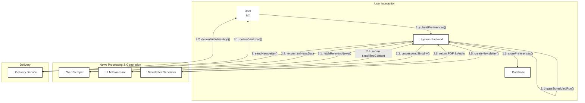

```mermaid
graph TD
    %% Changed to Top-Down layout for better alignment of independent flows

    %% --- Define Participants as Nodes ---
    subgraph User Interaction
        U["&nbsp;&nbsp;&nbsp;User&nbsp;&nbsp;&nbsp;<br/>&#128100;"]
        WB[": System Backend"]
        DB[": Database"]
    end

    subgraph "News Processing & Generation"
        SC[": Web Scraper"]
        LLMP[": LLM Processor"]
        GEN[": Newsletter Generator"]
    end
    
    subgraph Delivery
        DEL[": Delivery Service"]
    end

    %% --- Define Interactions as Labeled Links ---
    
    %% Flow 1: Preference Submission
    U -- "1. submitPreferences()" --> WB
    WB -- "1.1. storePreferences()" --> DB
    
    %% Flow 2: News Generation & Processing (Triggered by WebApp)
    %% Self-message for internal trigger
    WB -- "2. triggerScheduledRun()" --> WB
    WB -- "2.1. fetchRelevantNews()" --> SC
    SC -- "2.2. return rawNewsData" --> WB
    WB -- "2.3. processAndSimplify()" --> LLMP
    LLMP -- "2.4. return simplifiedContent" --> WB
    WB -- "2.5. createNewsletter()" --> GEN
    GEN -- "2.6. return PDF & Audio" --> WB
    
    %% Flow 3: Delivery
    WB -- "3. sendNewsletter()" --> DEL
    DEL -- "3.1. deliverViaEmail()" --> U
    DEL -- "3.2. deliverViaWhatsApp()" --> U

    %% --- Style nodes to look like UML objects ---
    style U fill:#fff,stroke-width:0px
    style WB fill:#fff,stroke:#333,stroke-width:2px
    style DB fill:#fff,stroke:#333,stroke-width:2px
    style SC fill:#fff,stroke:#333,stroke-width:2px
    style LLMP fill:#fff,stroke:#333,stroke-width:2px
    style GEN fill:#fff,stroke:#333,stroke-width:2px
    style DEL fill:#fff,stroke:#333,stroke-width:2px
```
