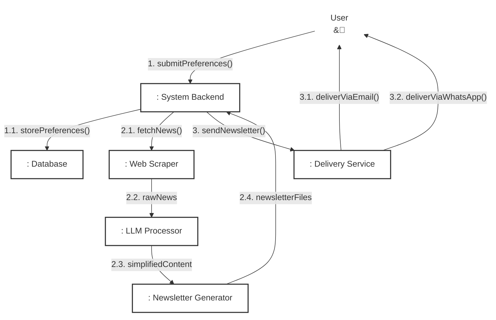

```mermaid
graph TD
    %% --- Participants ---
    User["User<br/>&#128100;"]
    Backend[": System Backend"]
    DB[": Database"]
    Scraper[": Web Scraper"]
    LLM[": LLM Processor"]
    Generator[": Newsletter Generator"]
    Delivery[": Delivery Service"]

    %% --- Interaction Flow ---
    User -- "1. submitPreferences()" --> Backend
    Backend -- "1.1. storePreferences()" --> DB
    Backend -- "2.1. fetchNews()" --> Scraper
    Scraper -- "2.2. rawNews" --> LLM
    LLM -- "2.3. simplifiedContent" --> Generator
    Generator -- "2.4. newsletterFiles" --> Backend
    Backend -- "3. sendNewsletter()" --> Delivery
    Delivery -- "3.1. deliverViaEmail()" --> User
    Delivery -- "3.2. deliverViaWhatsApp()" --> User

    %% --- Styling (B&W) ---
    style User fill:#fff,stroke-width:0px
    style Backend fill:#fff,stroke:#333,stroke-width:2px
    style DB fill:#fff,stroke:#333,stroke-width:2px
    style Scraper fill:#fff,stroke:#333,stroke-width:2px
    style LLM fill:#fff,stroke:#333,stroke-width:2px
    style Generator fill:#fff,stroke:#333,stroke-width:2px
    style Delivery fill:#fff,stroke:#333,stroke-width:2px
```
